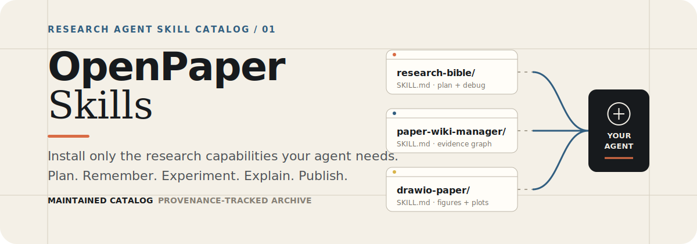
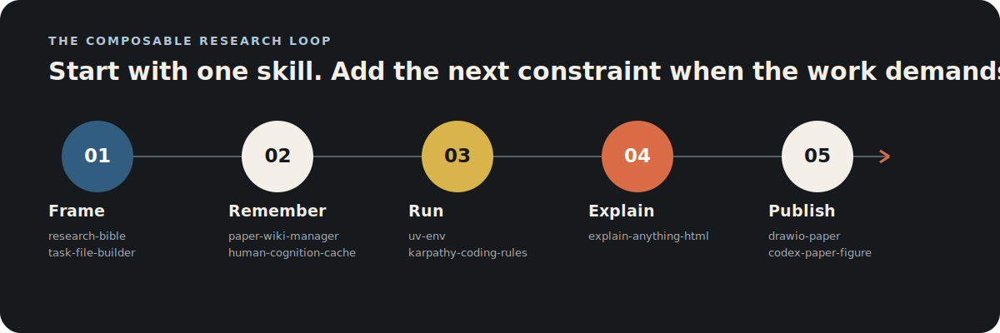

<p align="center">
  
</p>

<p align="center">
  <a href="https://agentskills.io/specification"></a>
  <a href="https://github.blog/changelog/2026-04-16-manage-agent-skills-with-github-cli/"></a>
  <a href="./LICENSE"></a>
</p>

<p align="center">
  <strong>Reusable research workflows for Codex, Claude Code, and other Agent Skills hosts.</strong><br>
  Install one focused capability—or compose a complete path from research question to paper artifact.
</p>

OpenPaper Skills is the standalone distribution of research skills developed in
[AI-Human Research OS](https://github.com/pengqianhan/AI-Human-Research-OS/tree/main/research-skills-hub).
Each skill packages instructions, references, scripts, and templates behind one
`SKILL.md`, so an existing agent project can gain a research capability without
adopting an entire workspace.

> [!TIP]
> Need the complete long-horizon environment—project templates, research memory,
> human context, paper wiki, and operating rules? Start with
> [AI-Human Research OS](https://github.com/pengqianhan/AI-Human-Research-OS).

## Start in 60 seconds

`gh skill` is available in GitHub CLI **v2.90.0 or later** and is currently in
public preview. Preview a skill before installing it:

```bash
gh skill preview pengqianhan/openpaper research-bible
```

Then install one skill for Codex at user scope:

```bash
gh skill install pengqianhan/openpaper research-bible --agent codex --scope user
```

Or install the full maintained catalog:

```bash
gh skill install pengqianhan/openpaper --all --agent codex --scope user
```

Replace `codex` with another supported host such as `claude-code` when needed.
See GitHub's [`gh skill` guide](https://docs.github.com/en/copilot/how-tos/copilot-on-github/customize-copilot/customize-cloud-agent/add-skills)
for install scopes, updates, and version pinning.

## Pick a path through the catalog

<p align="center">
  
</p>

You do not need the whole stack. A few useful starting combinations:

| If you want to… | Start with… | Add when needed… |
| --- | --- | --- |
| Turn an idea into an executable research plan | [`research-bible`](skills/research-bible/) | [`task-file-builder`](skills/task-file-builder/) for clean session handoffs |
| Keep papers, concepts, and project links connected | [`paper-wiki-manager`](skills/paper-wiki-manager/) | [`human-cognition-cache`](skills/human-cognition-cache/) for human context and knowledge state |
| Produce publication-ready diagrams and plots | [`drawio-paper`](skills/drawio-paper/) | [`codex-paper-figure-skill`](skills/codex-paper-figure-skill/) for editable figure concepts |
| Explain a paper or difficult concept interactively | [`explain-anything-html`](skills/explain-anything-html/) | [`discover-academic-skills`](skills/discover-academic-skills/) to locate adjacent capabilities |
| Build a complete durable research workspace | [AI-Human Research OS](https://github.com/pengqianhan/AI-Human-Research-OS) | Use this repository only for selectively installed skills |

## Maintained skills

Everything under [`skills/`](skills/) is part of the installable OpenPaper
catalog and is discovered by GitHub CLI through the
`skills/<skill-name>/SKILL.md` convention.

| Skill | Description |
| --- | --- |
<!-- BEGIN GENERATED SKILLS CATALOG -->
| [`codex-paper-figure-skill`](skills/codex-paper-figure-skill/) | Create editable, journal-style academic figures and diagrams from paper text or figure descriptions. |
| [`discover-academic-skills`](skills/discover-academic-skills/) | Find and evaluate research-oriented agent skills with academic-relevance and quality gates. |
| [`drawio-paper`](skills/drawio-paper/) | Generate publication-quality academic diagrams and statistical plots. |
| [`explain-anything-html`](skills/explain-anything-html/) | Produce rich HTML explanations of papers, articles, documentation, and complex concepts. |
| [`human-cognition-cache`](skills/human-cognition-cache/) | Maintain a project-local, git-trackable cache of human context and knowledge state. |
| [`karpathy-coding-rules`](skills/karpathy-coding-rules/) | Apply a focused set of coding rules and working conventions. |
| [`map-then-territory`](skills/map-then-territory/) | Draw a human-verifiable route map from start to destination, then drive agents through the territory edge by edge. |
| [`okf-repo-organizer`](skills/okf-repo-organizer/) | Organize repositories and knowledge corpora into Open Knowledge Format bundles. |
| [`paper-wiki-manager`](skills/paper-wiki-manager/) | Maintain a structured paper wiki, including paper notes, concepts, topics, and visualizations. |
| [`research-bible`](skills/research-bible/) | Turn ML/AI research principles into research plans, experiment loops, logs, and debugging routines. |
| [`task-file-builder`](skills/task-file-builder/) | Draft context-rich `task.md` briefs for fresh agent sessions. |
| [`uv-env`](skills/uv-env/) | Create and manage Python environments and dependencies with `uv`. |
| [`writing-great-prompt`](skills/writing-great-prompt/) | Turn an intent into a lean, copy-ready prompt contract with destination, evidence, authority, and completion bar. |
<!-- END GENERATED SKILLS CATALOG -->

Catalog maintenance notes live in [`skills/README.md`](skills/README.md).

## Two catalogs, one clear trust boundary

| Directory | What it contains | Installed by `--all`? |
| --- | --- | :---: |
| [`skills/`](skills/) | OpenPaper-maintained, publishable skills | Yes |
| [`collected-skills/`](collected-skills/) | Third-party skills retained for provenance, evaluation, or adaptation | No |

Collected skills keep their upstream attribution and license terms. Before
using one, inspect its `SKILL.md`, scripts, network access, source, and license.
The repository-level MIT license does **not** replace third-party terms. See the
[collected catalog and intake rules](collected-skills/README.md).

## Distribution and provenance

OpenPaper Skills has one development source and one installable distribution:

```text
AI-Human Research OS / research-skills-hub
                    │
                    │ daily, manual, or repository-dispatch sync
                    ▼
          pengqianhan/openpaper
          ├── skills/             installable catalog
          └── collected-skills/   provenance archive
```

The [`sync-upstream-skills`](.github/workflows/sync-upstream-skills.yml)
workflow mirrors child directories containing `SKILL.md`. Repository-specific
README files are preserved, [`.syncignore`](.syncignore) exclusions are honored,
and [`.upstream-revision`](.upstream-revision) records the exact source commit
after synchronization.

<details>
<summary><strong>Maintainer setup: trigger an immediate cross-repository sync</strong></summary>

Add the following workflow to
`AI-Human-Research-OS/.github/workflows/notify-openpaper-sync.yml`:

```yaml
name: Notify OpenPaper skill sync

on:
  push:
    branches: [main]
    paths:
      - "research-skills-hub/open-paper-skills/**"
      - "research-skills-hub/collected-skills/**"

jobs:
  notify:
    runs-on: ubuntu-latest
    steps:
      - name: Trigger OpenPaper sync
        env:
          GH_TOKEN: ${{ secrets.OPENPAPER_DISPATCH_TOKEN }}
        run: |
          gh api repos/pengqianhan/openpaper/dispatches \
            --method POST \
            -f event_type=research-skills-updated \
            -f "client_payload[source_sha]=${GITHUB_SHA}"
```

Create `OPENPAPER_DISPATCH_TOKEN` as a fine-grained token scoped only to
`pengqianhan/openpaper` with **Contents: read and write**, then save it as an
Actions secret in AI-Human Research OS. In this repository, enable
**Settings → Actions → General → Workflow permissions → Read and write**.

</details>

## Release a reproducible catalog

Validate metadata and repository settings before publishing:

```bash
gh skill publish --dry-run
```

Tag releases, then pin installations when reproducibility matters:

```bash
gh skill install pengqianhan/openpaper research-bible --pin v0.1.0
```

Record the full `research-skills-hub` commit SHA in each sync commit or release
note so an installed release can be reconciled with its development source.

## Repository map

```text
openpaper/
├── skills/             # maintained skills published through gh skill
├── collected-skills/   # third-party provenance and evaluation archive
├── scripts/            # catalog synchronization tooling
├── assets/readme/      # editable README visual system
└── .github/workflows/  # automated upstream synchronization
```

## License

OpenPaper-owned code and documentation are licensed under the
[MIT License](LICENSE). Every entry in `collected-skills/` retains its upstream
license and attribution.
