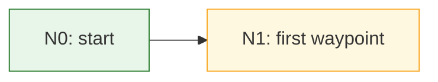

# Map Schema

Single source of truth for map bundle layout, fields, statuses, and Mermaid
conventions. Starting template: [../templates/map-index.md](../templates/map-index.md).

## Bundle layout

The bundle lives at the root of the territory it maps:

- Repository-level endeavor: `maps/<slug>/` at the repo root.
- Research project: `projects-folder/<Project>/map/`.
- Anywhere else: `<territory-root>/map/`.

```
<bundle>/
  index.md      # the map: Mermaid overview + waypoint and edge ledgers
  tutorials/    # one file per taught waypoint: N<id>-<slug>.md
  prompts/      # one launch prompt per assembled edge: E<id>-<slug>.md
```

`index.md` is canonical. Never store map state anywhere else.

## Frontmatter

`index.md` opens with four fields:

```yaml
map: <slug>
territory: <path or one-line description of where the work happens>
status: drafting | approved | executing | paused | complete | abandoned
created: <YYYY-MM-DD>
```

Bundle `status` transitions: `drafting` → `approved` when the human approves
the map and its idea ledger has no `unresolved` disposition (SKILL.md step 2);
`approved` → `executing` when the first edge launches; `executing` ⇄ `paused`
at the human's word; `executing` → `complete` when the destination waypoint is
`verified`; any state → `abandoned` only together with a written record of why.

## Stable IDs

- Idea fragments are `I1, I2, …`; waypoints are `N1, N2, …`; edges are
  `E1, E2, …`, each numbered in order of first appearance.
- An ID is assigned once and never reused after its entity is retired. Renaming
  keeps the ID.

## Idea ledger

Preserve every human-supplied idea fragment before translating it into route
structure:

```markdown
## Idea ledger

| ID | Idea (verbatim) | Disposition |
| --- | --- | --- |
| I1 | <the human's words> | unresolved |
```

Set `Disposition` to the destination, one or more waypoint or edge IDs, or
`out-of-scope — <human-approved rationale>`. Use `unresolved` only while the
bundle is `drafting`; approval requires every row to have a final disposition.
One row may point to several IDs when an idea shapes multiple route elements.

When revising an older map that has no ledger, begin one with newly supplied
fragments. Preserve repository evidence instead of reconstructing missing
ideas from an unavailable conversation.

## Waypoint entry

One `###` section per waypoint in the `## Waypoints` ledger:

```markdown
### N7 — <short state title>
- state: <what is true of the world when this waypoint is reached — a state, never a task>
- acceptance: <the check the human runs personally, without knowing the tech stack>
- type: directional | executive
- status: proposed | approved | in-progress | delivered | verified | dead
- tutorial: <link into tutorials/, when one exists>
- agent_verdict: <pass/fail + one line, written by the executing agent at delivery>
- human_verdict: <pass/fail + one line, written by the human at verification>
- evidence: <commands run, outputs, artifact paths backing delivered>
- post-mortem: <cause of death — dead waypoints only>
```

Status meanings:

| Status | Meaning |
| --- | --- |
| `proposed` | On the map, not yet approved by the human |
| `approved` | Human approved state + acceptance + type |
| `in-progress` | Work on an incoming edge has started and the state is not yet delivered |
| `delivered` | Executing agent claims the state and self-verified (`agent_verdict` + `evidence` present) |
| `verified` | The human ran the acceptance check personally — human-only transition |
| `dead` | Abandoned; `post-mortem` is mandatory |

## Edge entry

One `###` section per edge in the `## Edges` ledger:

```markdown
### E3 — N2 → N7
- action: <what is done>
- transition_logic: <why this action moves the territory from N2's state to N7's state>
- prompt: <link into prompts/, once assembled>
- status: drafted | ready | running | done | dead
- deviations: <dated log lines — see the execution-loop reference>
```

An edge becomes `ready` when all of these hold: its prompt file is assembled
under `prompts/`; the human has reviewed that prompt, when the target waypoint
is directional; and its source waypoint is `verified` — or is the start, or is
`delivered` with its type under `spot-check` delegation (semantics in
[execution-loop.md](execution-loop.md)). An edge is sized to one clean agent
session; if its prompt cannot fit one session, split the target waypoint.

## Mermaid overview

Keep one `flowchart LR` block at the top of `index.md`. Node labels are
`N<id>: <short title>`; status is shown by class:



Update the diagram in the same edit as the ledger — they must never disagree;
on conflict the ledger wins.

## Calibration ledger

A table at the bottom of `index.md` tracking agent–human verification
agreement per waypoint type — the data that justifies later delegation:

```markdown
| type | checks compared | agreements | delegation |
| --- | --- | --- | --- |
| directional | 4 | 4 | human-verifies-all |
| executive | 9 | 8 | human-verifies-all |
```

`delegation` moves from `human-verifies-all` to `spot-check` only by the
human's explicit, dated decision recorded beneath the table; the agent never
downgrades it. What `spot-check` changes at execution time is defined in
[execution-loop.md](execution-loop.md).
