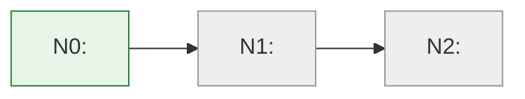

# Map: <title>

**Start:** <what exists now>
**Destination:** <what must become true>

## Idea ledger

| ID | Idea (verbatim) | Disposition |
| --- | --- | --- |
| I1 | <preserve the human's original wording> | unresolved |

## Overview

## Waypoints

### N0 — <start state title>
- state: <what is already true>
- acceptance: <how the human confirmed it>
- type: executive
- status: verified

### N1 — <state title>
- state:
- acceptance:
- type: directional | executive
- status: proposed
- tutorial:
- agent_verdict:
- human_verdict:
- evidence:

### N2 — <destination state title>
- state:
- acceptance:
- type: directional | executive
- status: proposed
- tutorial:
- agent_verdict:
- human_verdict:
- evidence:

## Edges

### E1 — N0 → N1
- action:
- transition_logic:
- prompt:
- status: drafted
- deviations:

### E2 — N1 → N2
- action:
- transition_logic:
- prompt:
- status: drafted
- deviations:

## Calibration ledger

| type | checks compared | agreements | delegation |
| --- | --- | --- | --- |
| directional | 0 | 0 | human-verifies-all |
| executive | 0 | 0 | human-verifies-all |
